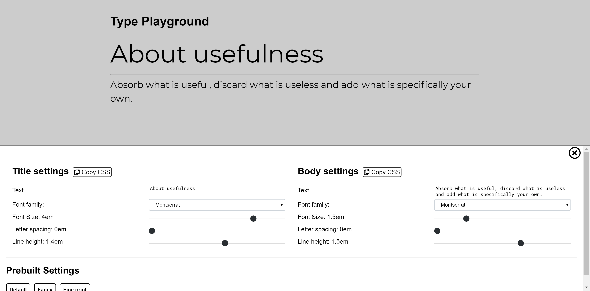

# Typography Playground <a href="https://victor-cordova.github.io/typography-playground/" target="_blank">DEMO</a>




# Description
Simple playground to preview combinations of font related styles

## Features
- Toggle between serif and sans serif fonts
- Copy CSS styles to cliboard
- Enter custom text

## Technologies used
- React.js with ejected create-react-app template
- SASS

## Requirements
- npm

## How to use
```bash
npm install
npm start
```
